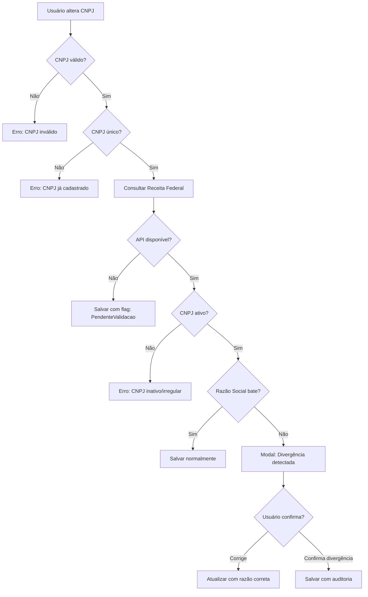

# 👤 Perfil de Usuário e Configurações da Empresa - Sistema Aure

## 📋 Visão Geral

Este documento define a estrutura completa de dados de usuários, configurações pessoais, informações empresariais e preferências de notificação no sistema Aure.

---

## 🏗️ Estrutura de Dados do Usuário

### Dados Pessoais (Todos os Usuários)

```csharp
public class User
{
    // Identificação
    public Guid Id { get; set; }
    public string Nome { get; set; }
    public string Email { get; set; }
    public UserRole Role { get; set; }
    
    // Perfil
    public string? AvatarUrl { get; set; }
    public DateTime? DataNascimento { get; set; }
    
    // Documentos (Criptografados)
    public string? CPFEncrypted { get; set; }
    public string? RGEncrypted { get; set; }
    
    [NotMapped]
    public string? CPF 
    { 
        get => !string.IsNullOrEmpty(CPFEncrypted) ? _encryptionService.Decrypt(CPFEncrypted) : null;
        set => CPFEncrypted = !string.IsNullOrEmpty(value) ? _encryptionService.Encrypt(value) : null;
    }
    
    [NotMapped]
    public string? RG 
    { 
        get => !string.IsNullOrEmpty(RGEncrypted) ? _encryptionService.Decrypt(RGEncrypted) : null;
        set => RGEncrypted = !string.IsNullOrEmpty(value) ? _encryptionService.Encrypt(value) : null;
    }
    
    // Contatos
    public string? TelefoneCelular { get; set; }
    public string? TelefoneFixo { get; set; }
    
    // Endereço Residencial (para Financeiro, Jurídico, CLT, PJ)
    // Para DonoEmpresaPai, usar endereço da empresa
    public string? EnderecoRua { get; set; }
    public string? EnderecoNumero { get; set; }
    public string? EnderecoComplemento { get; set; }
    public string? EnderecoBairro { get; set; }
    public string? EnderecoCidade { get; set; }
    public string? EnderecoEstado { get; set; }
    public string? EnderecoPais { get; set; }
    public string? EnderecoCep { get; set; }
    
    // Cargo/Função (para CLT e PJ)
    // Dropdown: Desenvolvedor, Designer, Analista, Consultor, etc + "Outro"
    public string? Cargo { get; set; }
    
    // Empresa vinculada (Empresa Pai - sempre 1)
    public Guid CompanyId { get; set; }
    public Company Company { get; set; }
    
    // Dados da Empresa PJ (apenas para FuncionarioPJ - apenas 1 no momento)
    public Guid? EmpresaPJId { get; set; }
    public Company? EmpresaPJ { get; set; }
    
    // Preferências de Notificação
    public NotificationPreferences NotificationPreferences { get; set; }
    
    // Termos e Auditoria (separados)
    public bool AceitouTermosUso { get; set; }
    public DateTime? DataAceiteTermosUso { get; set; }
    public string? VersaoTermosUsoAceita { get; set; }
    
    public bool AceitouPoliticaPrivacidade { get; set; }
    public DateTime? DataAceitePoliticaPrivacidade { get; set; }
    public string? VersaoPoliticaPrivacidadeAceita { get; set; }
    
    // Auditoria
    public DateTime CreatedAt { get; set; }
    public DateTime UpdatedAt { get; set; }
    public bool IsDeleted { get; set; }
}
```

### Preferências de Notificação

```csharp
public class NotificationPreferences
{
    public Guid Id { get; set; }
    public Guid UserId { get; set; }
    
    // Notificações de Contrato (para DonoEmpresaPai, Financeiro, Jurídico, PJ)
    public bool ReceberEmailNovoContrato { get; set; } = true;
    public bool ReceberEmailContratoAssinado { get; set; } = true;
    public bool ReceberEmailContratoVencendo { get; set; } = true;
    
    // Notificações de Pagamento (para DonoEmpresaPai, Financeiro, PJ)
    public bool ReceberEmailPagamentoProcessado { get; set; } = true;
    public bool ReceberEmailPagamentoRecebido { get; set; } = true;
    
    // Notificações Operacionais (para DonoEmpresaPai, Financeiro, Jurídico)
    public bool ReceberEmailNovoFuncionario { get; set; } = true;
    public bool ReceberEmailAlertasFinanceiros { get; set; } = true;
    
    // Notificações de Sistema (todos)
    public bool ReceberEmailAtualizacoesSistema { get; set; } = true;
    
    public DateTime CreatedAt { get; set; }
    public DateTime UpdatedAt { get; set; }
}
```

---

## 🎯 Regras por Role

### DonoEmpresaPai
**Dados Específicos:**
- Endereço = Endereço da Empresa (mesmo endereço)
- Cargo = "Proprietário" ou "CEO" (fixo ou personalizável)

**Notificações Disponíveis:**
- ✅ Contratos (novo, assinado, vencendo)
- ✅ Pagamentos (processado, alertas financeiros)
- ✅ Operacionais (novos funcionários, alertas)
- ✅ Sistema

### Financeiro
**Dados Específicos:**
- Endereço = Residencial (diferente da empresa)
- Cargo = "Gerente Financeiro", "Analista Financeiro", etc.

**Notificações Disponíveis:**
- ✅ Contratos (novo, assinado, vencendo)
- ✅ Pagamentos (processado - mas NÃO recebe cópia de "recebido" do PJ)
- ✅ Operacionais (novos funcionários)
- ✅ Sistema

### Jurídico
**Dados Específicos:**
- Endereço = Residencial
- Cargo = "Advogado", "Assistente Jurídico", etc.

**Notificações Disponíveis:**
- ✅ Contratos (novo, assinado, vencendo)
- ❌ Pagamentos (não tem acesso a dados financeiros)
- ✅ Operacionais (novos funcionários)
- ✅ Sistema

### FuncionarioCLT
**Dados Específicos:**
- Endereço = Residencial
- Cargo = "Desenvolvedor", "Designer", "Recepcionista", "Analista", etc.

**Notificações Disponíveis:**
- ✅ Contratos (próprio contrato CLT)
- ❌ Pagamentos (folha de pagamento é via RH)
- ✅ Sistema

### FuncionarioPJ
**Dados Específicos:**
- Endereço = Residencial
- Cargo = "Desenvolvedor", "Consultor", "Designer", etc.
- **Empresa PJ**: Razão Social, CNPJ, Endereço da Empresa

**Notificações Disponíveis:**
- ✅ Contratos (próprios contratos para assinar)
- ✅ Pagamentos (SOMENTE recebido - quando recebe pagamento)
- ✅ Sistema

---

## 🖥️ Estrutura de Telas

### 1. Painel (Dashboard)

#### DonoEmpresaPai
```
┌─────────────────────────────────────────────────┐
│ 📊 Visão Geral Financeira                       │
├─────────────────────────────────────────────────┤
│ 💰 Total Pago Este Mês: R$ 125.000,00          │
│ 📅 Próximos Pagamentos: R$ 45.000,00           │
│ 📈 Economia vs Mês Anterior: +12%              │
├─────────────────────────────────────────────────┤
│ 📋 Contratos                                     │
│ • Ativos: 15                                    │
│ • Vencendo em 30 dias: 3                       │
│ • Aguardando Assinatura: 2                     │
├─────────────────────────────────────────────────┤
│ 👥 Funcionários                                  │
│ • CLT: 8                                        │
│ • PJ: 15                                        │
│ • Financeiro: 2                                 │
│ • Jurídico: 1                                   │
├─────────────────────────────────────────────────┤
│ 🎂 Aniversariantes do Mês                       │
│ • João Silva (Dev) - 05/11                     │
│ • Maria Santos (Designer) - 12/11              │
│ • Pedro Costa (Analista) - 28/11               │
├─────────────────────────────────────────────────┤
│ ⚡ Ações Rápidas                                │
│ [Processar Pagamento] [Novo Contrato]          │
│ [Convidar Funcionário] [Relatórios]            │
└─────────────────────────────────────────────────┘
```

#### Financeiro
```
┌─────────────────────────────────────────────────┐
│ 📊 Gestão Operacional                           │
├─────────────────────────────────────────────────┤
│ 👥 Funcionários                                  │
│ • Total: 26                                     │
│ • CLT: 8 | PJ: 15                              │
│ • Novos este mês: 3                            │
├─────────────────────────────────────────────────┤
│ 📋 Contratos                                     │
│ • Aguardando Assinatura: 2                     │
│ • Vencendo em 30 dias: 3                       │
├─────────────────────────────────────────────────┤
│ 💼 Tarefas Pendentes                            │
│ • Revisar contrato de João Silva               │
│ • Processar documentos de Maria Santos         │
├─────────────────────────────────────────────────┤
│ 🎂 Aniversariantes do Mês                       │
│ • João Silva - 05/11                           │
│ • Maria Santos - 12/11                         │
├─────────────────────────────────────────────────┤
│ ⚡ Ações Rápidas                                │
│ [Novo Contrato] [Ver Funcionários]             │
│ [Relatórios] [Documentos]                      │
└─────────────────────────────────────────────────┘
```

#### Jurídico
```
┌─────────────────────────────────────────────────┐
│ ⚖️ Gestão Jurídica                              │
├─────────────────────────────────────────────────┤
│ 📋 Contratos                                     │
│ • Aguardando Assinatura: 2                     │
│ • Vencendo nos próximos 30 dias: 3             │
│ • Vencendo nos próximos 60 dias: 5             │
├─────────────────────────────────────────────────┤
│ 📄 Documentos                                    │
│ • Contratos Ativos: 15                          │
│ • Aditivos Pendentes: 1                        │
├─────────────────────────────────────────────────┤
│ ⚡ Ações Rápidas                                │
│ [Novo Contrato] [Ver Contratos]                │
│ [Documentos] [Relatórios]                      │
└─────────────────────────────────────────────────┘
```

#### Funcionário PJ
```
┌─────────────────────────────────────────────────┐
│ 💼 Meu Painel                                    │
├─────────────────────────────────────────────────┤
│ 💰 Próximo Pagamento                            │
│ • Valor: R$ 8.000,00                           │
│ • Previsão: 05/11/2025                         │
├─────────────────────────────────────────────────┤
│ 📋 Meu Contrato                                  │
│ • Status: Ativo                                 │
│ • Vigência: 01/06/2025 - 31/05/2026           │
│ • Valor Mensal: R$ 8.000,00                    │
├─────────────────────────────────────────────────┤
│ 📊 Histórico de Pagamentos (Últimos 6 Meses)    │
│ Gráfico de barras...                            │
├─────────────────────────────────────────────────┤
│ ⚠️ Pendências                                   │
│ • Contrato para assinar: 1                     │
└─────────────────────────────────────────────────┘
```

#### Funcionário CLT
```
┌─────────────────────────────────────────────────┐
│ 💼 Meu Painel                                    │
├─────────────────────────────────────────────────┤
│ 📋 Meu Contrato CLT                             │
│ • Status: Ativo                                 │
│ • Data de Admissão: 15/03/2024                 │
│ • Cargo: Desenvolvedor Full Stack              │
├─────────────────────────────────────────────────┤
│ 📄 Documentos                                    │
│ • Contrato de Trabalho                         │
│ • Termos de Confidencialidade                  │
├─────────────────────────────────────────────────┤
│ ℹ️ Informações                                  │
│ Para questões de pagamento, consulte o RH      │
└─────────────────────────────────────────────────┘
```

---

### 2. Tela: Funcionários (Lista Completa)

**Acesso:** DonoEmpresaPai, Financeiro, Jurídico

```
┌─────────────────────────────────────────────────────────────────┐
│ 👥 Funcionários                           [+ Convidar Usuário]  │
├─────────────────────────────────────────────────────────────────┤
│ 🔍 Filtros:                                                      │
│ [Todos ▼] [CLT] [PJ] [Financeiro] [Jurídico]                   │
│ Buscar: [___________________] 🔎                                │
├─────────────────────────────────────────────────────────────────┤
│ Nome            │ Cargo              │ Tipo       │ Status │ Ações│
│─────────────────┼────────────────────┼────────────┼────────┼──────│
│ João Silva      │ Desenvolvedor      │ PJ         │ 🟢 Ativo│ [👁️]│
│ Maria Santos    │ Designer           │ CLT        │ 🟢 Ativo│ [👁️]│
│ Pedro Costa     │ Analista Financeiro│ Financeiro │ 🟢 Ativo│ [👁️]│
│ Ana Oliveira    │ Advogada           │ Jurídico   │ 🟢 Ativo│ [👁️]│
│ Carlos Lima     │ Consultor          │ PJ         │ 🟡 Pendente│[👁️]│
└─────────────────────────────────────────────────────────────────┘
```

**Campos da Listagem:**
- Nome
- Cargo
- Tipo (Role)
- Status (Ativo, Pendente Aceite, Inativo)
- Data de Entrada
- Email
- Telefone
- Ações (Ver Detalhes, Editar, Desativar)

**Filtros:**
- Por Role (Todos, CLT, PJ, Financeiro, Jurídico)
- Por Status (Ativo, Pendente, Inativo)
- Por Cargo (Desenvolvedor, Designer, Analista, etc.)
- Busca por Nome ou Email

---

### 3. Tela: Configurações (Perfil Pessoal)

**Acesso:** Todos os usuários

#### Aba 1: Dados Pessoais

```
┌─────────────────────────────────────────────────┐
│ 👤 Dados Pessoais                               │
├─────────────────────────────────────────────────┤
│ 📸 Foto de Perfil:                              │
│ [Avatar] [Alterar Foto] [Remover]              │
│                                                 │
│ Nome Completo: [________________________]       │
│ Email:         [________________________]       │
│ CPF:           [___.___.___-__] (Dono vê todos)│
│ RG:            [________________] (opcional)    │
│ Data Nasc.:    [__/__/____] (opcional)         │
│ Cargo:         [Dropdown ▼] ou [Campo Livre]   │
│                (visível apenas para CLT e PJ)   │
│                                                 │
│ 📞 Contatos                                     │
│ Celular:       [________________________]       │
│ Telefone Fixo: [________________________]       │
│                                                 │
│ 📍 Endereço Residencial                         │
│ (Para DonoEmpresaPai: mesmo endereço da empresa)│
│ Rua:           [________________________]       │
│ Número:        [_______] Complemento: [_______] │
│ Bairro:        [________________________]       │
│ Cidade:        [____________] Estado: [___]     │
│ CEP:           [_________] País: [________]     │
│                                                 │
│ 🔒 Segurança                                    │
│ Senha Atual:   [________________________]       │
│ Nova Senha:    [________________________]       │
│ Confirmar:     [________________________]       │
│                                                 │
│                         [Cancelar] [Salvar]     │
└─────────────────────────────────────────────────┘
```

#### Aba 2: Minha Empresa PJ (Apenas para FuncionarioPJ)

```
┌─────────────────────────────────────────────────┐
│ 🏢 Minha Empresa PJ                             │
├─────────────────────────────────────────────────┤
│ Razão Social:  [________________________]       │
│ CNPJ:          [________________________]       │
│                                                 │
│ 📍 Endereço da Empresa                          │
│ Rua:           [________________________]       │
│ Número:        [_______] Complemento: [_______] │
│ Bairro:        [________________________]       │
│ Cidade:        [____________] Estado: [___]     │
│ CEP:           [_________] País: [________]     │
│                                                 │
│ 💼 Informações Adicionais                       │
│ Tipo:          [Cliente/Fornecedor ▼]          │
│ Modelo:        [PJ Contratado ▼]               │
│                                                 │
│                         [Cancelar] [Salvar]     │
└─────────────────────────────────────────────────┘
```

#### Aba 3: Notificações

**Layout Dinâmico por Role:**

**Para DonoEmpresaPai:**
```
┌─────────────────────────────────────────────────┐
│ 🔔 Preferências de Notificação                  │
├─────────────────────────────────────────────────┤
│ 📋 Contratos                                     │
│ ☑️ Novo contrato criado                         │
│ ☑️ Contrato assinado                            │
│ ☑️ Contrato vencendo (30, 15, 7 dias)          │
│                                                 │
│ 💰 Pagamentos                                    │
│ ☑️ Pagamento processado com sucesso             │
│ ☑️ Alertas financeiros (valores altos, etc.)    │
│                                                 │
│ 👥 Operações                                     │
│ ☑️ Novo funcionário cadastrado                  │
│ ☑️ Convite aceito                               │
│                                                 │
│ ⚙️ Sistema                                      │
│ ☑️ Atualizações do sistema                      │
│                                                 │
│                                     [Salvar]     │
└─────────────────────────────────────────────────┘
```

**Para Financeiro:**
```
┌─────────────────────────────────────────────────┐
│ 🔔 Preferências de Notificação                  │
├─────────────────────────────────────────────────┤
│ 📋 Contratos                                     │
│ ☑️ Novo contrato criado                         │
│ ☑️ Contrato assinado                            │
│ ☑️ Contrato vencendo                            │
│                                                 │
│ 💰 Pagamentos                                    │
│ ☑️ Pagamento processado (notificação interna)   │
│                                                 │
│ 👥 Operações                                     │
│ ☑️ Novo funcionário cadastrado                  │
│                                                 │
│ ⚙️ Sistema                                      │
│ ☑️ Atualizações do sistema                      │
│                                                 │
│                                     [Salvar]     │
└─────────────────────────────────────────────────┘
```

**Para Jurídico:**
```
┌─────────────────────────────────────────────────┐
│ 🔔 Preferências de Notificação                  │
├─────────────────────────────────────────────────┤
│ 📋 Contratos                                     │
│ ☑️ Novo contrato criado                         │
│ ☑️ Contrato assinado                            │
│ ☑️ Contrato vencendo                            │
│                                                 │
│ 👥 Operações                                     │
│ ☑️ Novo funcionário cadastrado                  │
│                                                 │
│ ⚙️ Sistema                                      │
│ ☑️ Atualizações do sistema                      │
│                                                 │
│                                     [Salvar]     │
└─────────────────────────────────────────────────┘
```

**Para FuncionarioPJ:**
```
┌─────────────────────────────────────────────────┐
│ 🔔 Preferências de Notificação                  │
├─────────────────────────────────────────────────┤
│ 📋 Contratos                                     │
│ ☑️ Novo contrato para assinar                   │
│ ☑️ Contrato vencendo                            │
│                                                 │
│ 💰 Pagamentos                                    │
│ ☑️ Pagamento recebido                           │
│                                                 │
│ ⚙️ Sistema                                      │
│ ☑️ Atualizações do sistema                      │
│                                                 │
│                                     [Salvar]     │
└─────────────────────────────────────────────────┘
```

**Para FuncionarioCLT:**
```
┌─────────────────────────────────────────────────┐
│ 🔔 Preferências de Notificação                  │
├─────────────────────────────────────────────────┤
│ ⚙️ Sistema                                      │
│ ☑️ Atualizações do sistema                      │
│                                                 │
│ ℹ️ Para questões de pagamento, consulte o RH   │
│                                                 │
│                                     [Salvar]     │
└─────────────────────────────────────────────────┘
```

#### Aba 4: Termos e Privacidade

```
┌─────────────────────────────────────────────────┐
│ 📜 Termos e Privacidade                         │
├─────────────────────────────────────────────────┤
│ ✅ Termos de Uso                                │
│ Status: Aceito                                  │
│ Data de Aceite: 15/10/2025 às 14:30           │
│ Versão Aceita: 1.2.0                           │
│ [📄 Ver Termos de Uso Completos]               │
│                                                 │
│ ✅ Política de Privacidade                      │
│ Status: Aceito                                  │
│ Data de Aceite: 15/10/2025 às 14:30           │
│ Versão Aceita: 1.0.5                           │
│ [📄 Ver Política de Privacidade Completa]      │
│                                                 │
│ 📊 Dados e Privacidade (LGPD)                   │
│ [Exportar Meus Dados]                          │
│ [Solicitar Exclusão de Conta]                  │
└─────────────────────────────────────────────────┘
```

---

### 4. Tela: Empresa (Informações da Empresa Pai)

**Acesso:** DonoEmpresaPai, Financeiro, Jurídico (somente leitura para Financeiro/Jurídico)

```
┌─────────────────────────────────────────────────┐
│ 🏢 Informações da Empresa                       │
├─────────────────────────────────────────────────┤
│ Razão Social:  [________________________]       │
│                (editável apenas por Dono)       │
│ CNPJ:          [________________________]       │
│                (não editável)                   │
│                                                 │
│ 📍 Endereço da Empresa                          │
│ Rua:           [________________________]       │
│ Número:        [_______] Complemento: [_______] │
│ Bairro:        [________________________]       │
│ Cidade:        [____________] Estado: [___]     │
│ CEP:           [_________] País: [________]     │
│                                                 │
│ 💼 Informações Corporativas                     │
│ Tipo:          [Cliente/Fornecedor/Ambos ▼]    │
│ Modelo:        [Empresa Principal ▼]           │
│                                                 │
│ 📊 Estatísticas                                 │
│ • Funcionários Totais: 26                      │
│ • Contratos Ativos: 15                         │
│ • Data de Cadastro: 10/01/2025                 │
│                                                 │
│          [Cancelar] [Salvar] (apenas Dono)      │
└─────────────────────────────────────────────────┘
```

---

## 🔄 Fluxo: Aceite de Termos

### Quando Ocorre
1. **Novo usuário** aceitando convite
2. **Atualização de termos** (usuários existentes devem aceitar nova versão)

### Modal de Aceite de Termos (Separados)

```
┌─────────────────────────────────────────────────┐
│ ⚠️ Termos de Uso e Política de Privacidade     │
├─────────────────────────────────────────────────┤
│ 📋 Aba: [Termos de Uso] [Política Privacidade] │
│                                                 │
│ [Área rolável com texto...]                     │
│                                                 │
│ TERMOS DE USO - Versão 1.2.0                   │
│ Última atualização: 01/10/2025                 │
│                                                 │
│ ... (conteúdo dos termos) ...                  │
│                                                 │
├─────────────────────────────────────────────────┤
│ ☐ Li e aceito os Termos de Uso (v1.2.0)       │
│ ☐ Li e aceito a Política de Privacidade (v1.0.5)│
│                                                 │
│ ⚠️ Ambos os documentos devem ser aceitos       │
│                                                 │
│ Ao aceitar, você concorda com:                 │
│ • Uso de dados conforme política LGPD         │
│ • Normas de conduta da plataforma             │
│ • Responsabilidades contratuais               │
│ • Coleta e armazenamento de CPF/RG            │
│                                                 │
│                [Recusar] [Aceitar e Continuar]  │
└─────────────────────────────────────────────────┘
```

### Registro de Aceite (Separado)
```csharp
// Termos de Uso
user.AceitouTermosUso = true;
user.DataAceiteTermosUso = DateTime.UtcNow;
user.VersaoTermosUsoAceita = "1.2.0";

// Política de Privacidade
user.AceitouPoliticaPrivacidade = true;
user.DataAceitePoliticaPrivacidade = DateTime.UtcNow;
user.VersaoPoliticaPrivacidadeAceita = "1.0.5";
```

### Auditoria (Ambos documentos)
```csharp
// Log para Termos de Uso
await _auditService.LogAsync(new AuditLog
{
    UserId = user.Id,
    Action = AuditAction.AcceptTerms,
    EntityType = "User",
    EntityId = user.Id,
    Description = $"Usuário aceitou Termos de Uso versão {versaoTermos}",
    IpAddress = httpContext.Connection.RemoteIpAddress.ToString(),
    Timestamp = DateTime.UtcNow
});

// Log para Política de Privacidade
await _auditService.LogAsync(new AuditLog
{
    UserId = user.Id,
    Action = AuditAction.AcceptPrivacyPolicy,
    EntityType = "User",
    EntityId = user.Id,
    Description = $"Usuário aceitou Política de Privacidade versão {versaoPrivacidade}",
    IpAddress = httpContext.Connection.RemoteIpAddress.ToString(),
    Timestamp = DateTime.UtcNow
});

// Log de visualização de CPF/RG (LGPD)
await _auditService.LogAsync(new AuditLog
{
    UserId = currentUserId,
    Action = AuditAction.ViewSensitiveData,
    EntityType = "User",
    EntityId = targetUserId,
    Description = $"Visualizou CPF/RG de {userName}",
    IpAddress = httpContext.Connection.RemoteIpAddress.ToString(),
    Timestamp = DateTime.UtcNow
});
```

---

## 📊 Endpoints da API

### 1. Atualizar Perfil Completo

**PUT** `/api/Users/perfil-completo`

```csharp
public class UpdateFullProfileRequest
{
    // Dados Pessoais
    public string? Nome { get; set; }
    public string? Email { get; set; }
    public DateTime? DataNascimento { get; set; }
    public string? CPF { get; set; } // Será criptografado no backend
    public string? RG { get; set; }  // Será criptografado no backend
    public string? Cargo { get; set; } // CLT e PJ apenas
    
    // Contatos
    public string? TelefoneCelular { get; set; }
    public string? TelefoneFixo { get; set; }
    
    // Endereço
    public string? EnderecoRua { get; set; }
    public string? EnderecoNumero { get; set; }
    public string? EnderecoComplemento { get; set; }
    public string? EnderecoBairro { get; set; }
    public string? EnderecoCidade { get; set; }
    public string? EnderecoEstado { get; set; }
    public string? EnderecoPais { get; set; }
    public string? EnderecoCep { get; set; }
    
    // Senha (opcional)
    public string? SenhaAtual { get; set; }
    public string? NovaSenha { get; set; }
}

// Response com CPF/RG mascarados para não-Donos
public class UserProfileResponse
{
    public Guid Id { get; set; }
    public string Nome { get; set; }
    public string Email { get; set; }
    public string? AvatarUrl { get; set; }
    public DateTime? DataNascimento { get; set; }
    public string? CPFMascarado { get; set; } // ***.***.123-45
    public string? CPF { get; set; }          // Apenas para Dono
    public string? RG { get; set; }           // Apenas para Dono
    public string? Cargo { get; set; }
    public string? TelefoneCelular { get; set; }
    public string? TelefoneFixo { get; set; }
    public string? EnderecoCompleto { get; set; }
    // ... demais campos
}
```

### 2. Atualizar Empresa PJ (Apenas FuncionarioPJ)

**PUT** `/api/Users/empresa-pj`

```csharp
public class UpdateCompanyPJRequest
{
    public string? RazaoSocial { get; set; }
    public string? Cnpj { get; set; }
    public string? EnderecoRua { get; set; }
    public string? EnderecoNumero { get; set; }
    public string? EnderecoComplemento { get; set; }
    public string? EnderecoBairro { get; set; }
    public string? EnderecoCidade { get; set; }
    public string? EnderecoEstado { get; set; }
    public string? EnderecoPais { get; set; }
    public string? EnderecoCep { get; set; }
    public CompanyType? CompanyType { get; set; }
    public bool ConfirmarDivergenciaRazaoSocial { get; set; } = false; // Se usuário confirmar divergência
}

public class UpdateCompanyPJResponse
{
    public bool Sucesso { get; set; }
    public string? Mensagem { get; set; }
    public CompanyPJData? Empresa { get; set; }
    
    // Validação CNPJ x Razão Social
    public bool DivergenciaRazaoSocial { get; set; }
    public string? RazaoSocialReceita { get; set; } // Razão social oficial da Receita
    public string? RazaoSocialInformada { get; set; }
    public bool RequerConfirmacao { get; set; }
}
```

**Fluxo de Validação**:
1. Usuário altera CNPJ
2. Backend valida formato do CNPJ
3. Backend consulta API da Receita Federal
4. Se Razão Social divergir:
   - Retorna `DivergenciaRazaoSocial = true`
   - Retorna `RazaoSocialReceita` (oficial)
   - Retorna `RazaoSocialInformada` (digitada pelo usuário)
   - Frontend mostra modal de confirmação
5. Usuário confirma ou corrige
6. Se confirmar, reenvia request com `ConfirmarDivergenciaRazaoSocial = true`
7. Backend registra divergência na auditoria

### 3. Preferências de Notificação

**GET** `/api/Users/notificacoes/preferencias`

**PUT** `/api/Users/notificacoes/preferencias`

```csharp
public class NotificationPreferencesDTO
{
    // Contratos
    public bool ReceberEmailNovoContrato { get; set; }
    public bool ReceberEmailContratoAssinado { get; set; }
    public bool ReceberEmailContratoVencendo { get; set; }
    
    // Pagamentos
    public bool ReceberEmailPagamentoProcessado { get; set; }
    public bool ReceberEmailPagamentoRecebido { get; set; }
    
    // Operacionais
    public bool ReceberEmailNovoFuncionario { get; set; }
    public bool ReceberEmailAlertasFinanceiros { get; set; }
    
    // Sistema
    public bool ReceberEmailAtualizacoesSistema { get; set; }
}
```

### 4. Upload de Avatar

**POST** `/api/Users/avatar`

**Content-Type**: `multipart/form-data`

**Request**:
- `file`: Arquivo de imagem (JPG, PNG, máx 5MB)

**Response**:
```csharp
public class AvatarUploadResponse
{
    public string AvatarUrl { get; set; }
    public string ThumbnailUrl { get; set; }
}
```

**DELETE** `/api/Users/avatar`

Remove avatar e volta para iniciais.

### 5. Aceitar Termos (Separados)

**POST** `/api/Users/aceitar-termos`

```csharp
public class AcceptTermsRequest
{
    public string VersaoTermosUso { get; set; }          // Ex: "1.2.0"
    public string VersaoPoliticaPrivacidade { get; set; } // Ex: "1.0.5"
    public bool AceitouTermosUso { get; set; }
    public bool AceitouPoliticaPrivacidade { get; set; }
}
```

**GET** `/api/Users/termos/versoes`

Retorna versões atuais dos documentos:
```csharp
public class TermsVersionsResponse
{
    public string VersaoTermosUsoAtual { get; set; }
    public string VersaoPoliticaPrivacidadeAtual { get; set; }
    public bool UsuarioPrecisaAceitar { get; set; }
}
```

### 5. Obter Informações da Empresa Pai

**GET** `/api/Companies/empresa-pai`

```csharp
public class CompanyInfoResponse
{
    public Guid Id { get; set; }
    public string RazaoSocial { get; set; }
    public string Cnpj { get; set; }
    public CompanyType CompanyType { get; set; }
    public BusinessModel BusinessModel { get; set; }
    
    // Endereço
    public string? EnderecoCompleto { get; set; }
    
    // Estatísticas
    public int TotalFuncionarios { get; set; }
    public int ContratosAtivos { get; set; }
    public DateTime DataCadastro { get; set; }
}
```

### 6. Atualizar Empresa Pai (Apenas DonoEmpresaPai)

**PUT** `/api/Companies/empresa-pai`

```csharp
public class UpdateCompanyRequest
{
    public string? RazaoSocial { get; set; }
    public string? EnderecoRua { get; set; }
    public string? EnderecoNumero { get; set; }
    public string? EnderecoComplemento { get; set; }
    public string? EnderecoBairro { get; set; }
    public string? EnderecoCidade { get; set; }
    public string? EnderecoEstado { get; set; }
    public string? EnderecoPais { get; set; }
    public string? EnderecoCep { get; set; }
    public CompanyType? CompanyType { get; set; }
}
```

### 7. Listar Funcionários com Filtros

**GET** `/api/Users/funcionarios`

**Query Parameters:**
- `pageNumber` (int)
- `pageSize` (int)
- `role` (UserRole? - filtrar por tipo)
- `cargo` (string? - filtrar por cargo)
- `status` (string? - "Ativo", "Pendente", "Inativo")
- `busca` (string? - buscar por nome ou email)

```csharp
public class EmployeeListItemResponse
{
    public Guid Id { get; set; }
    public string Nome { get; set; }
    public string Email { get; set; }
    public string Role { get; set; }
    public string? Cargo { get; set; }
    public string Status { get; set; } // "Ativo", "Pendente", "Inativo"
    public DateTime DataEntrada { get; set; }
    public string? TelefoneCelular { get; set; }
}
```

---

## 🔍 Validação CNPJ x Razão Social (Receita Federal)

### Importância
A validação garante compliance fiscal e evita fraudes, verificando se os dados informados batem com os dados oficiais da Receita Federal.

### APIs Disponíveis

#### 1. ReceitaWS (Gratuita)
```
GET https://receitaws.com.br/v1/cnpj/{cnpj}
```

**Response**:
```json
{
  "cnpj": "12.345.678/0001-90",
  "nome": "EMPRESA EXEMPLO LTDA",
  "fantasia": "EMPRESA EXEMPLO",
  "situacao": "ATIVA",
  "data_situacao": "01/01/2020",
  "uf": "SP",
  "municipio": "SAO PAULO",
  "logradouro": "RUA EXEMPLO",
  "numero": "123",
  "complemento": "SALA 1",
  "bairro": "CENTRO",
  "cep": "01234-567"
}
```

**Limitações**:
- Limite: 3 requisições por minuto
- Usar cache para evitar bloqueios
- Fallback manual se API falhar

#### 2. Brasil API (Alternativa)
```
GET https://brasilapi.com.br/api/cnpj/v1/{cnpj}
```

### Fluxo de Validação Completo



### Implementação Backend

```csharp
public class CnpjValidationService : ICnpjValidationService
{
    private readonly IHttpClientFactory _httpClientFactory;
    private readonly ILogger<CnpjValidationService> _logger;
    private readonly IMemoryCache _cache;
    
    public async Task<ReceitaFederalResponse> GetCompanyDataFromReceita(string cnpj)
    {
        // Remove formatação
        cnpj = cnpj.Replace(".", "").Replace("/", "").Replace("-", "");
        
        // Verifica cache (24 horas)
        var cacheKey = $"cnpj_{cnpj}";
        if (_cache.TryGetValue(cacheKey, out ReceitaFederalResponse cachedData))
        {
            return cachedData;
        }
        
        try
        {
            var client = _httpClientFactory.CreateClient();
            var response = await client.GetAsync($"https://receitaws.com.br/v1/cnpj/{cnpj}");
            
            if (!response.IsSuccessStatusCode)
            {
                _logger.LogWarning("Falha ao consultar Receita Federal. Status: {Status}", response.StatusCode);
                return null;
            }
            
            var data = await response.Content.ReadFromJsonAsync<ReceitaFederalResponse>();
            
            // Cache por 24 horas
            _cache.Set(cacheKey, data, TimeSpan.FromHours(24));
            
            return data;
        }
        catch (Exception ex)
        {
            _logger.LogError(ex, "Erro ao consultar Receita Federal para CNPJ {Cnpj}", cnpj);
            return null;
        }
    }
    
    public async Task<(bool matches, string officialName)> ValidateRazaoSocialMatch(string cnpj, string razaoSocial)
    {
        var data = await GetCompanyDataFromReceita(cnpj);
        
        if (data == null)
        {
            // API indisponível - permitir com flag
            return (true, razaoSocial);
        }
        
        // Normalizar strings para comparação
        var official = NormalizeString(data.Nome);
        var informed = NormalizeString(razaoSocial);
        
        // Comparação flexível (permite pequenas diferenças)
        var similarity = CalculateSimilarity(official, informed);
        
        // Se similaridade > 85%, considera válido
        if (similarity > 0.85)
        {
            return (true, data.Nome);
        }
        
        return (false, data.Nome);
    }
    
    private string NormalizeString(string str)
    {
        if (string.IsNullOrEmpty(str)) return string.Empty;
        
        return str
            .ToUpperInvariant()
            .Trim()
            .Replace("LTDA", "")
            .Replace("S/A", "")
            .Replace("ME", "")
            .Replace("EPP", "")
            .Replace("-", "")
            .Replace(".", "");
    }
    
    private double CalculateSimilarity(string s1, string s2)
    {
        // Algoritmo de Levenshtein Distance
        // Retorna valor entre 0 e 1 (1 = idêntico)
        // Implementação simplificada
        
        if (s1 == s2) return 1.0;
        
        int distance = LevenshteinDistance(s1, s2);
        int maxLength = Math.Max(s1.Length, s2.Length);
        
        return 1.0 - ((double)distance / maxLength);
    }
    
    public async Task<bool> IsCnpjUnique(string cnpj, Guid? excludeCompanyId)
    {
        cnpj = cnpj.Replace(".", "").Replace("/", "").Replace("-", "");
        
        var query = _context.Companies.Where(c => c.Cnpj == cnpj && !c.IsDeleted);
        
        if (excludeCompanyId.HasValue)
        {
            query = query.Where(c => c.Id != excludeCompanyId.Value);
        }
        
        return !await query.AnyAsync();
    }
    
    public async Task<(bool isActive, string situacao)> IsCnpjActive(string cnpj)
    {
        var data = await GetCompanyDataFromReceita(cnpj);
        
        if (data == null)
        {
            // API indisponível - permitir com aviso
            return (true, "Pendente Validação");
        }
        
        var situacoesAtivas = new[] { "ATIVA", "ATIVO" };
        var isActive = situacoesAtivas.Contains(data.Situacao?.ToUpperInvariant());
        
        return (isActive, data.Situacao);
    }
}

public class ReceitaFederalResponse
{
    [JsonPropertyName("cnpj")]
    public string Cnpj { get; set; }
    
    [JsonPropertyName("nome")]
    public string Nome { get; set; } // Razão Social
    
    [JsonPropertyName("fantasia")]
    public string Fantasia { get; set; }
    
    [JsonPropertyName("situacao")]
    public string Situacao { get; set; }
    
    [JsonPropertyName("data_situacao")]
    public string DataSituacao { get; set; }
    
    [JsonPropertyName("uf")]
    public string UF { get; set; }
    
    [JsonPropertyName("municipio")]
    public string Municipio { get; set; }
    
    [JsonPropertyName("logradouro")]
    public string Logradouro { get; set; }
    
    [JsonPropertyName("numero")]
    public string Numero { get; set; }
    
    [JsonPropertyName("complemento")]
    public string Complemento { get; set; }
    
    [JsonPropertyName("bairro")]
    public string Bairro { get; set; }
    
    [JsonPropertyName("cep")]
    public string Cep { get; set; }
}
```

### Modal de Confirmação (Frontend)

```typescript
// Quando houver divergência
if (response.divergenciaRazaoSocial) {
  showConfirmModal({
    title: '⚠️ Divergência de Razão Social',
    message: `
      A Razão Social informada não corresponde aos dados da Receita Federal.
      
      Informado por você: ${response.razaoSocialInformada}
      Consta na Receita: ${response.razaoSocialReceita}
      
      Deseja corrigir ou confirmar a divergência?
    `,
    buttons: [
      {
        label: 'Corrigir para Razão Oficial',
        action: () => updateWithOfficialName(response.razaoSocialReceita)
      },
      {
        label: 'Manter Minha Versão',
        action: () => confirmDivergence(),
        warning: true
      },
      {
        label: 'Cancelar',
        action: () => cancel()
      }
    ]
  });
}
```

### Auditoria de Divergências

```csharp
await _auditService.LogAsync(new AuditLog
{
    UserId = userId,
    Action = AuditAction.CnpjRazaoSocialDivergence,
    EntityType = "Company",
    EntityId = companyId,
    Description = $"Divergência: Informado '{razaoSocialInformada}' vs Receita '{razaoSocialReceita}'",
    Timestamp = DateTime.UtcNow,
    Metadata = new Dictionary<string, object>
    {
        { "CnpjInformado", cnpj },
        { "RazaoSocialInformada", razaoSocialInformada },
        { "RazaoSocialReceita", razaoSocialReceita },
        { "UsuarioConfirmouDivergencia", true }
    }
});
```

### Regras de Negócio

1. **CNPJ Inválido**: Bloquear salvamento
2. **CNPJ Duplicado**: Bloquear salvamento
3. **CNPJ Inativo**: Bloquear salvamento com mensagem clara
4. **Razão Social Divergente**:
   - Se similaridade > 85%: Permitir automaticamente
   - Se similaridade < 85%: Solicitar confirmação do usuário
   - Se API indisponível: Salvar com flag `PendenteValidacao = true`
5. **Auditoria**: Sempre registrar divergências confirmadas

### Cache e Performance

- **Cache de 24 horas** para dados da Receita
- **Rate limiting**: Máximo 3 requisições por minuto
- **Retry policy**: 2 tentativas com delay de 2 segundos
- **Fallback**: Se API falhar, permitir salvamento com flag de validação pendente

### Validação Periódica (Background Job)

```csharp
// Hangfire - executar diariamente
RecurringJob.AddOrUpdate(
    "validate-pending-cnpj",
    () => _cnpjValidationService.ValidatePendingCompanies(),
    Cron.Daily
);
```

---

## ✅ Validações e Regras de Negócio

### Cargo
- **Obrigatório para**: FuncionarioCLT, FuncionarioPJ
- **Opcional para**: Financeiro, Juridico
- **Fixo/Automático para**: DonoEmpresaPai (ex: "Proprietário")
- **Formato**: Dropdown com opções pré-definidas + opção "Outro" (campo livre)
- Máximo 100 caracteres
- **Cargos Pré-definidos**:
  - Desenvolvedor Full Stack
  - Desenvolvedor Frontend
  - Desenvolvedor Backend
  - Designer UI/UX
  - Analista de Sistemas
  - Analista Financeiro
  - Gerente de Projetos
  - Consultor
  - Recepcionista
  - Assistente Administrativo
  - Contador
  - Advogado
  - Outro (campo livre)

### Endereço
- **DonoEmpresaPai**: 
  - ✅ **CONFIRMADO**: Usar endereço da empresa (sincronizado automaticamente)
  - ✅ Ao atualizar perfil de Dono, atualiza também endereço da empresa
  - Backend deve manter sincronização bidirecional
- **Outros Roles**: 
  - Endereço residencial independente
  - Não sincroniza com empresa

### Notificações
- **Formato**: Apenas email (no momento)
- Preferências devem respeitar permissões por role
- Backend valida se notificação é permitida antes de criar
- Usuário pode desabilitar notificações, mas avisos críticos (ex: conta bloqueada) não podem ser desabilitados
- **Futuro**: Sistema de notificações in-app com badge e central de notificações

### Termos
- **Formato**: Documentos separados - "Termos de Uso" + "Política de Privacidade"
- **Aceite obrigatório** no primeiro acesso (ambos documentos)
- **Bloqueio de sistema** se termos forem atualizados e usuário não aceitar nova versão
- Auditoria completa: quem aceitou, quando, versão, IP
- Armazenar aceites separados:
  ```csharp
  public bool AceitouTermosUso { get; set; }
  public DateTime? DataAceiteTermosUso { get; set; }
  public string? VersaoTermosUsoAceita { get; set; }
  
  public bool AceitouPoliticaPrivacidade { get; set; }
  public DateTime? DataAceitePoliticaPrivacidade { get; set; }
  public string? VersaoPoliticaPrivacidadeAceita { get; set; }
  ```

### Empresa PJ
- **Visível apenas** para FuncionarioPJ
- **Limitação**: Um funcionário PJ tem apenas 1 empresa PJ (no momento)
- **Futuro**: Preparar arquitetura para múltiplas empresas PJ por usuário
- **CNPJ único** no sistema (bloquear duplicados)
- **Validação de CNPJ** válido (dígitos verificadores)
- **⚠️ CRÍTICO**: Validação de CNPJ x Razão Social via API da Receita Federal
  - Ao alterar CNPJ, buscar dados na Receita Federal
  - Comparar Razão Social informada com a oficial
  - Se divergir, alertar usuário com a razão social correta
  - Permitir prosseguir apenas se razão social bater ou usuário confirmar divergência
  - Registrar divergências em auditoria

---

## 🔍 Considerações de UX

### Dashboard Personalizado
- Mostrar informações relevantes para cada role
- Evitar sobrecarga de informações
- Ações rápidas contextuais
- Gráficos simples e objetivos

### Configurações
- Abas claras e organizadas
- Campos desabilitados quando não editáveis
- Indicações visuais de campos obrigatórios
- Validação em tempo real

### Notificações
- Apenas opções relevantes por role
- Descrições claras do que cada notificação faz
- Exemplos de quando notificação é enviada
- Aviso de notificações críticas que não podem ser desabilitadas

### Listagem de Funcionários
- Filtros intuitivos
- Busca rápida
- Indicadores visuais de status
- Ações contextuais por role

---

## 🚀 Próximos Passos para Implementação

### 1. Migrations
```
AddUserProfileFields:
- AvatarUrl (string, nullable)
- DataNascimento (DateTime, nullable)
- CPFEncrypted (string, nullable, unique)
- RGEncrypted (string, nullable)
- EnderecoRua, EnderecoNumero, EnderecoComplemento, EnderecoBairro (strings, nullable)
- EnderecoCidade, EnderecoEstado, EnderecoPais, EnderecoCep (strings, nullable)
- Cargo (string, nullable)
- AceitouTermosUso, DataAceiteTermosUso, VersaoTermosUsoAceita
- AceitouPoliticaPrivacidade, DataAceitePoliticaPrivacidade, VersaoPoliticaPrivacidadeAceita

CreateNotificationPreferencesTable:
- Id, UserId (FK)
- ReceberEmailNovoContrato, ReceberEmailContratoAssinado, ReceberEmailContratoVencendo
- ReceberEmailPagamentoProcessado, ReceberEmailPagamentoRecebido
- ReceberEmailNovoFuncionario, ReceberEmailAlertasFinanceiros
- ReceberEmailAtualizacoesSistema
- CreatedAt, UpdatedAt
```

### 2. Serviços
```
IEncryptionService:
- Encrypt(string plainText): string
- Decrypt(string cipherText): string
- Implementação: AES-256 com chave em Azure Key Vault/AWS Secrets Manager

IAvatarService:
- UploadAvatar(IFormFile file, Guid userId): Task<AvatarUploadResponse>
- DeleteAvatar(Guid userId): Task
- GetAvatarUrl(Guid userId): string (com fallback para iniciais)

IAnonymizationService:
- AnonymizeUserData(Guid userId): Task<bool>
- ValidateCanDelete(Guid userId): Task<(bool canDelete, string reason)>

IBirthdayService:
- GetBirthdaysOfMonth(int month, int year): Task<List<BirthdayItem>>
- SendBirthdayEmail(Guid userId): Task (opcional - email automático)

ICnpjValidationService:
- ValidateCnpj(string cnpj): bool (valida dígitos verificadores)
- GetCompanyDataFromReceita(string cnpj): Task<ReceitaFederalResponse>
- ValidateRazaoSocialMatch(string cnpj, string razaoSocial): Task<(bool matches, string officialName)>
- IsCnpjUnique(string cnpj, Guid? excludeCompanyId): Task<bool>
- IsCnpjActive(string cnpj): Task<(bool isActive, string situacao)>
```

### 3. Backend
- ✅ Implementar endpoints de perfil completo
- ✅ Implementar endpoints de preferências de notificação
- ✅ Implementar lógica de aceite de termos (separados)
- ✅ Implementar upload/delete de avatar
- ✅ Atualizar serviço de notificações para respeitar preferências
- ✅ Criar filtros avançados para listagem de funcionários
- ✅ Implementar exportação Excel/PDF
- ✅ Adicionar auditoria de visualização de dados sensíveis (CPF/RG)
- ✅ Sincronização bidirecional de endereço DonoEmpresaPai <-> Empresa
- ✅ Implementar exportação LGPD de dados do usuário
- ✅ Implementar exclusão de conta com anonimização
- ✅ Implementar widget de aniversariantes
- ✅ Validação de CPF único (bloquear duplicados)

### 4. Frontend
- Criar dashboards personalizados por role
- Criar tela de configurações com 4 abas
- Criar tela de listagem de funcionários com filtros e exportação
- Implementar modal de aceite de termos (com abas)
- Criar tela de informações da empresa
- Implementar upload de avatar com preview
- Criar componente de avatar com fallback (iniciais)
- Implementar dropdown de cargos com opção "Outro"
- Implementar widget de aniversariantes no dashboard
- Implementar exportação LGPD (botão "Exportar Meus Dados")
- Implementar solicitação de exclusão de conta com modal de aviso

---

## 💡 Dados Adicionais Implementados

### ✅ 1. Avatar/Foto de Perfil
```csharp
public string? AvatarUrl { get; set; }
```
- **Upload de imagem**: JPG, PNG (máx 5MB)
- **Processamento automático**:
  - Crop quadrado (1:1)
  - Resize para 400x400px (original) e 80x80px (thumbnail)
  - Compressão automática
- **Storage**: Azure Blob Storage ou AWS S3
- **Fallback**: Avatar com iniciais do nome (ex: "JS" para João Silva)
- **URL pública**: `https://storage.aure.com/avatars/{userId}.jpg`

**Endpoint**:
```
POST /api/Users/avatar
Content-Type: multipart/form-data

DELETE /api/Users/avatar (remove avatar, volta para iniciais)
```

### ✅ 2. Data de Nascimento
```csharp
public DateTime? DataNascimento { get; set; }
```
- **Opcional** (mas recomendado)
- **Validações**:
  - Data no passado
  - Idade mínima: 16 anos
  - Idade máxima: 100 anos
- **Uso**:
  - Relatórios de RH
  - Aniversário do mês no dashboard (apenas para gestores)
  - Cálculo de idade para estatísticas

### ✅ 3. Documentos Pessoais (Compliance e Auditoria)
```csharp
// Campos criptografados no banco
public string? CPFEncrypted { get; set; }
public string? RGEncrypted { get; set; }

// Propriedades não mapeadas (apenas em memória)
[NotMapped]
public string? CPF 
{ 
    get => _encryptionService.Decrypt(CPFEncrypted);
    set => CPFEncrypted = _encryptionService.Encrypt(value);
}

[NotMapped]
public string? RG 
{ 
    get => _encryptionService.Decrypt(RGEncrypted);
    set => RGEncrypted = _encryptionService.Encrypt(value);
}
```

**Regras de Acesso**:
- **Visualizar**: Apenas DonoEmpresaPai
- **Editar**: Próprio usuário + DonoEmpresaPai
- **Exportação**: CPF sempre mascarado (***.***.123-45)
- **Logs**: Toda visualização de CPF/RG é auditada

**Validações**:
- CPF: Validação de dígitos verificadores
- RG: Apenas alfanumérico (formatos variam por estado)
- CPF único no sistema (não pode duplicar)

**Criptografia**:
```csharp
public interface IEncryptionService
{
    string Encrypt(string plainText);
    string Decrypt(string cipherText);
}

// Implementação usando AES-256
// Chave armazenada em Azure Key Vault ou AWS Secrets Manager
// NUNCA no código ou appsettings.json
```

### 4. Timezone do Usuário (Futuro)
```csharp
public string Timezone { get; set; } = "America/Sao_Paulo";
```
- Exibir datas no fuso horário do usuário
- Importante para usuários em diferentes regiões

### 5. Idioma/Locale (Futuro)
```csharp
public string Locale { get; set; } = "pt-BR";
```
- Preparar para internacionalização
- Formato de data, moeda, etc.

---

## ✅ Decisões Finalizadas

### Respostas Confirmadas:

1. **Cargo**: ✅ Misto - Dropdown pré-definido + opção "Outro" (campo livre)

2. **Endereço Dono**: ✅ CONFIRMADO - Mesmo endereço da empresa (sincronização bidirecional)

3. **Notificações In-App**: ✅ Apenas email no momento (futuro: in-app com badge)

4. **Empresa PJ**: ✅ Apenas 1 empresa PJ no momento (futuro: múltiplas)

5. **Termos**: ✅ Separados - "Termos de Uso" + "Política de Privacidade"

6. **Listagem Funcionários**: ✅ Exportação em Excel E PDF

7. **Multi-empresa**: ✅ Usuário em apenas 1 empresa no momento (futuro: múltiplas)

8. **Dados Adicionais**: ✅ Implementar:
   - Avatar/Foto de perfil
   - CPF/RG criptografados
   - Data de nascimento

---

## ✅ Decisões Finais Complementares:

### Respostas Adicionais Confirmadas:

1. **Auditoria de Alterações**: ✅ Logar apenas alterações **críticas**:
   - Senha alterada
   - Email alterado
   - CPF/RG adicionado/alterado
   - Termos aceitos
   - Avatar alterado
   - **NÃO** logar mudanças simples (telefone, endereço comum)

2. **CPF na Listagem**: ✅ Mostrar **mascarado** (***.***.123-45)
   - Visível completo apenas para DonoEmpresaPai ao clicar em "Ver Detalhes"

3. **Avatar Storage**: ✅ **Local** (FileSystem)
   - Pasta: `/wwwroot/uploads/avatars/`
   - Estrutura: `{userId}.jpg` e `{userId}_thumb.jpg`
   - Backup: Incluir pasta de avatars no backup da aplicação

4. **Exportação LGPD** ("Exportar Meus Dados"): ✅ Incluir:
   - ✅ Dados pessoais completos (nome, email, telefone, endereço, CPF, RG, data nascimento)
   - ✅ Histórico de contratos (todos os contratos vinculados)
   - ✅ Histórico de pagamentos recebidos (apenas PJ)
   - ✅ Logs de acesso (últimos 90 dias)
   - ✅ Preferências de notificação
   - ✅ Dados da empresa PJ (se aplicável)
   - **Formato**: JSON ou PDF

5. **Exclusão de Conta (LGPD + Legislação Fiscal)**: ✅ **Anonimização + Soft Delete**
   - ❌ **NÃO** deletar: Contratos, NFe, Pagamentos, Documentos fiscais (manter por 5 anos)
   - ✅ **Anonimizar**: Nome → "Usuário Removido {ID}", Email → "removed_{ID}@aure.deleted", Telefone → null
   - ✅ **Manter**: CPF/RG criptografados (para auditoria fiscal)
   - ✅ **Soft Delete**: IsDeleted = true, DeletedAt = DateTime.UtcNow
   - ✅ **Bloquear acesso**: Usuário não pode mais fazer login
   - ⚠️ **Aviso ao usuário**: "Seus dados pessoais serão anonimizados, mas documentos fiscais serão mantidos por 5 anos conforme legislação brasileira"

6. **CPF Duplicado**: ✅ **Bloquear** - CPF único no sistema
   - Validação no backend com mensagem clara: "CPF já cadastrado no sistema"

7. **Data de Nascimento**: ✅ **Visível completa** para todos (ou próprio usuário)
   - DonoEmpresaPai vê de todos
   - Outros usuários veem apenas a própria

8. **Aniversariantes no Dashboard**: ✅ **Implementar!**
   - Widget "🎂 Aniversariantes do Mês" para DonoEmpresaPai e Financeiro
   - Mostrar nome, cargo, data de aniversário
   - Ordenar por data mais próxima
   - Opcional: Enviar email automático de parabéns (configurável)

---

## 📊 Resumo Completo do Documento

### Este documento define:

#### Estrutura de Dados:
- ✅ User Entity completa (20+ campos)
- ✅ NotificationPreferences Entity
- ✅ CPF/RG criptografados (AES-256)
- ✅ Avatar/Foto de perfil (local storage)
- ✅ Data de nascimento
- ✅ Endereço completo (sincronizado para DonoEmpresaPai)
- ✅ Cargo (dropdown 13 opções + "Outro")
- ✅ Termos separados (Termos de Uso + Política de Privacidade)

#### Telas e Dashboards:
- ✅ 5 Dashboards personalizados por role (DonoEmpresaPai, Financeiro, Jurídico, PJ, CLT)
- ✅ Widget "🎂 Aniversariantes do Mês"
- ✅ Tela: Funcionários (lista completa com filtros)
- ✅ Tela: Configurações (4 abas)
- ✅ Tela: Empresa (informações da empresa pai)
- ✅ Modal: Aceite de termos (com abas)

#### API Endpoints (11 total):
1. PUT `/api/Users/perfil-completo` - Atualizar perfil
2. PUT `/api/Users/empresa-pj` - Atualizar empresa PJ
3. GET `/api/Users/notificacoes/preferencias` - Buscar preferências
4. PUT `/api/Users/notificacoes/preferencias` - Atualizar preferências
5. POST `/api/Users/avatar` - Upload avatar
6. DELETE `/api/Users/avatar` - Remover avatar
7. POST `/api/Users/aceitar-termos` - Aceitar termos
8. GET `/api/Users/termos/versoes` - Versões dos termos
9. GET `/api/Companies/empresa-pai` - Info empresa pai
10. PUT `/api/Companies/empresa-pai` - Atualizar empresa pai
11. GET `/api/Users/funcionarios` - Listar com filtros
12. GET `/api/Users/funcionarios/exportar` - Exportar Excel/PDF
13. GET `/api/Users/exportar-dados` - Exportação LGPD
14. DELETE `/api/Users/solicitar-exclusao` - Exclusão LGPD

#### Regras de Negócio:
- ✅ CPF único (bloqueado duplicados)
- ✅ CPF mascarado na listagem (***.***.123-45)
- ✅ Apenas DonoEmpresaPai vê CPF completo
- ✅ Auditoria de alterações críticas (senha, email, CPF, RG)
- ✅ Notificações apenas por email (futuro: in-app)
- ✅ Exportação Excel E PDF
- ✅ 1 empresa por usuário (futuro: múltiplas)
- ✅ 1 empresa PJ por FuncionarioPJ

#### LGPD e Compliance:
- ✅ Exportação completa de dados (JSON/PDF)
- ✅ Exclusão: Anonimização + Soft Delete
- ✅ Documentos fiscais mantidos 5 anos
- ✅ CPF/RG criptografados
- ✅ Auditoria de visualização de dados sensíveis
- ✅ Termos versionados com rastreamento

#### Serviços Necessários:
- ✅ IEncryptionService (AES-256)
- ✅ IAvatarService (upload, crop, resize)
- ✅ IExportService (Excel, PDF)
- ✅ IAnonymizationService (exclusão LGPD)

**📋 DOCUMENTO COMPLETO E PRONTO PARA IMPLEMENTAÇÃO!** 🚀

---

## 🎯 Próxima Ação Sugerida

Agora que temos as especificações completas, você quer que eu:

1. **Criar as Migrations** para adicionar todos os campos no banco?
2. **Implementar os Endpoints** da API um por um?
3. **Criar os Serviços** (Encryption, Avatar, Export, Anonymization)?
4. **Atualizar o Frontend Integration Guide** com os novos endpoints?

**Qual você prefere começar?** 🤔
